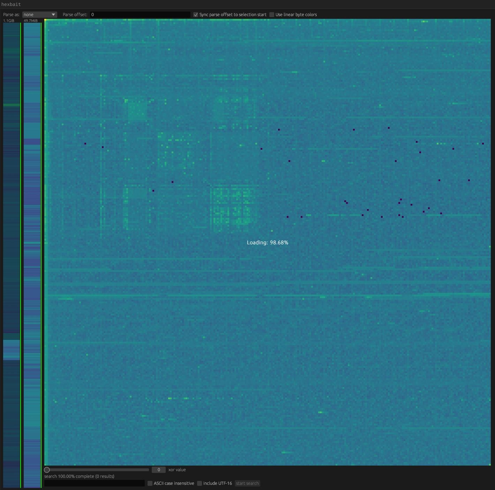
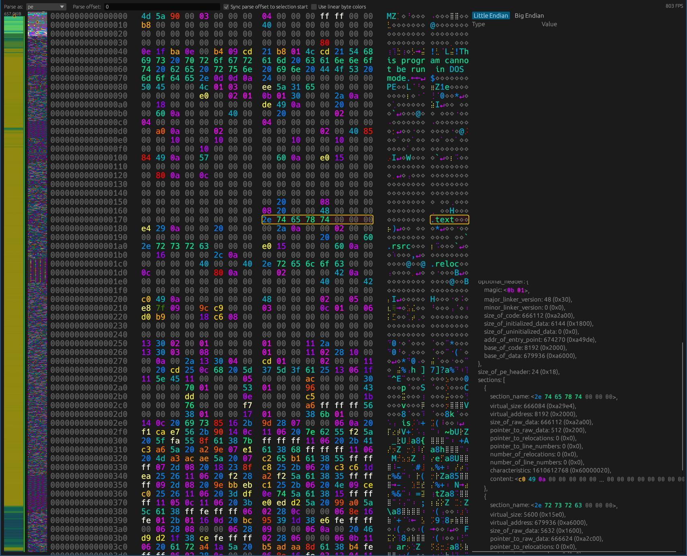

# hexbait - Hierarchical EXploration Binary Analysis & Inspection Tool

Hexbait is a hexviewer that makes byte-level analysis easier - and more fun!
It helps you understand files both at a very large overview-level - by showing patterns and thus helping find interesting sections - and at a single-byte level, but visualizing where parsed bytes originated.

**Important:** Hexbait is still very much a work in progress. Most planned features are just barely fleshed out. In some scenarios hexbait will just (safely) crash, because it is not yet fully implemented. Many parts of the codebase also need large overhauls. Still I have gotten quite a lot of good use out of hexbait already, so I decided to publish it even in this early stage.
There is not a lot of documentation yet.
I recommend you just play around with it (right now only mouse functions and copying with Ctrl+C are implemented, so you don't have to try keybindings).
The parsing language can probably best be understood by reading the `hexbait-lang/grammar.ungram` file.

## Some impressions

## Safety

If you want to open arbitrary files and possibly even parse them, safety is an important aspect.
That is why hexbait uses `#![forbid(unsafe)]` everywhere.
This means that bugs in hexbait can crash hexbait but not cause any memory corruption.
You should however beware that this does not mean that dependencies of hexbait are guaranteed to be bug-free.
Still, since most of the untrusted data is handled by hexbait itself, vulnerabilities are quite unlikely.

## Goals

- Easy and fun to use. The best tool for most jobs involving hex viewing.
- Easy to explore unknown data formats at the byte-level.
- Easy to get an overview of even very large files.

## Non-goals

- Hexbait is not and will never be a hex editor.
- Hexbait is not a hex diffing-tool. I am not saying it will never be one, but currently it does not fit into the vision.
